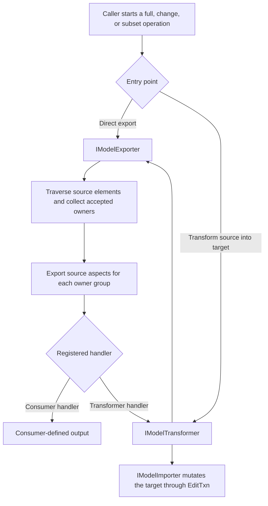
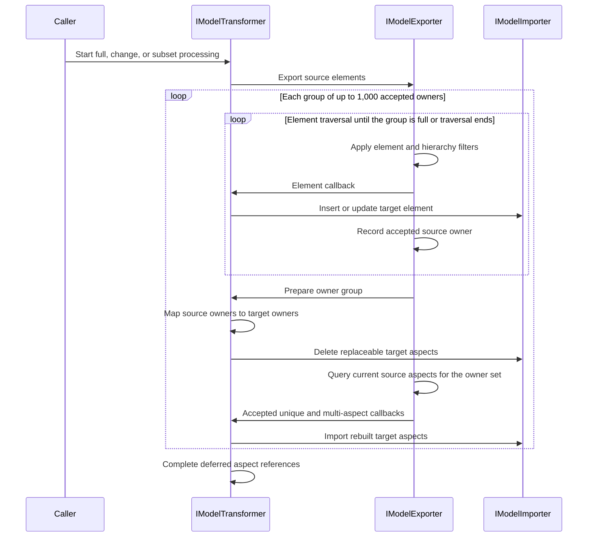

# Processing ElementAspects

`IModelExporter` processes ElementAspects separately from their owning element callbacks. It collects accepted element owners and exports their aspects in bounded, owner-scoped groups. Therefore, applications must not assume that an aspect callback immediately follows the callback for its owning element.

## When processing runs

Owner-batched ElementAspect processing runs whenever `IModelExporter` processes elements: a full export, a change export, or a subset export. Transformer subset methods such as `processElement` and `processSubject` use the same workflow.

`IModelExporter` can run by itself with a registered handler. When `IModelTransformer` drives the exporter, the transformer maps accepted source owners to target owners and `IModelImporter` applies the target changes through its active `EditTxn`.

An **owner** is the source `Element` referenced by an ElementAspect's `Element` property. An **accepted owner** is in the current operation's scope and has passed the same element, hierarchy, model, and `shouldExportElement` checks used during element traversal. Owner acceptance does not accept every aspect on that element. Class exclusion and `shouldExportElementAspect` are applied afterward.



| Component | Boundary |
| --- | --- |
| `IModelExporter` | Reads the source, applies owner and aspect filters, collects accepted owners, and emits aspects. It has no target to clean when used directly. |
| `IModelTransformer` | Maps source owners to target owners and coordinates cleanup before rebuild. |
| `IModelImporter` | Owns target writes. Aspect cleanup uses its active `EditTxn` and `onDeleteElementAspect` override. |

## Transformer-backed processing

Full, change, and subset transforms use the same owner-scoped sequence:



Cleanup and rebuild use the same accepted owner set. If an element changes, the exporter rebuilds all accepted current aspects for that owner, including aspects that did not have their own change record. This prevents cleanup from deleting unchanged aspects and handles aspect classes that became empty.

## Existing customization points

The public customization points remain on `IModelExportHandler` and `IModelExporter`:

```ts
[[include:ElementAspectProcessingExamples_handler.code]]
```

```ts
[[include:ElementAspectProcessingExamples_exportAll.code]]
```

The exporter applies owner acceptance first, then class exclusion, then `shouldExportElementAspect`, and finally the export callback.

## Change processing

For an accepted changed owner, the transformer removes replaceable target aspects through the active `EditTxn` and rebuilds the owner from the source. This also handles source aspect classes that are now empty. Excluded classes and transformer provenance aspects are not removed.

Custom inserted and updated aspect changes infer the owner while the source aspect exists. Deleted or missing source aspects cannot provide their owner, so `addCustomAspectChange` requires the source owner ID and throws when it is omitted:

```ts
[[include:ElementAspectProcessingExamples_deletedChange.code]]
```

The owner argument is change metadata. It does not select an aspect-processing strategy or customize the owner-batched workflow.

## Subset and large-model processing

`processElement`, `processModel`, `processModelContents`, and `processSubject` scope ElementAspect processing to the elements accepted by that operation.

For full, change, and subset traversals, the exporter records up to 1,000 accepted owner IDs at a time. When the group reaches 1,000, or when element traversal ends:

1. The transformer maps the source owners, then the importer deletes replaceable aspects for the mapped target owners.
2. The exporter queries and emits the current source aspects for the same owner group.
3. The processed owner IDs are discarded before the next group is collected.

Grouping bounds the in-memory owner set and the IDs passed to each ECSQL query. It also avoids issuing a separate aspect query for every owner. The group size is an internal coordination rule, not a public setting.

> **Invariant:** Within one built-in full, change, or subset operation, an owner processed in one group is not added to a later group. The workflow does not keep a transform-wide visited-owner set because that set would grow with the model. Instead, element traversal adds each accepted owner through one model/parent path, and the aspect-only change pass excludes owners already handled as element inserts or updates. A later explicit operation creates a new scope and may intentionally process the same owner again.

The implementation also:

- binds each owner group into source and target ECSQL with `InVirtualSet`;
- caches stable unique and multi-aspect class metadata;
- pages target cleanup;
- keeps each multi-aspect callback scoped to one owner; and
- retains aspect remaps in a core `BigMap` until deferred references are complete.

Entity filters and importer callbacks still run per entity because they are existing behavior boundaries. The database work for scoped aspect reads and cleanup is set-based.

Applications should not depend on an ordering relationship between element callbacks and aspect callbacks. Use source and target IDs supplied to the callbacks, and keep custom state keyed by those IDs when a workflow needs to correlate them.
