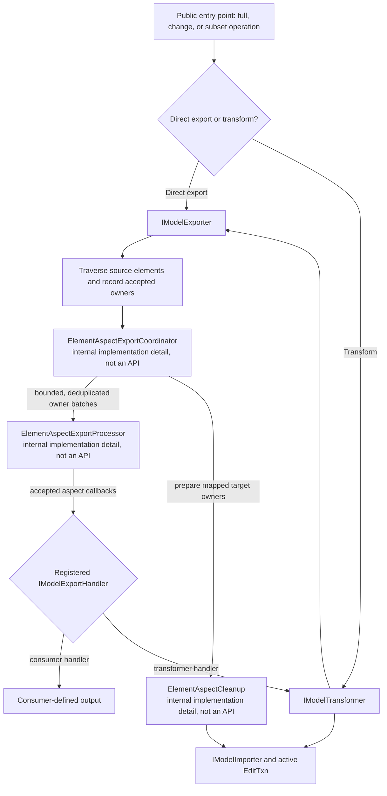
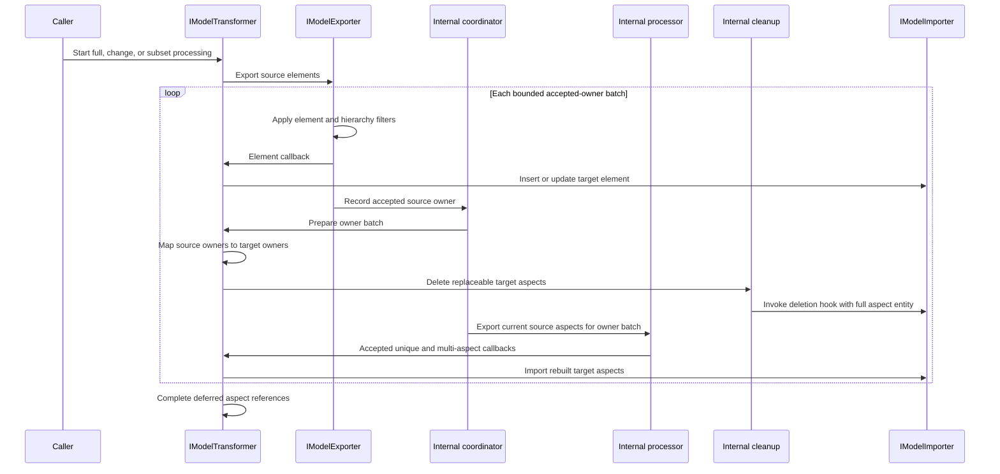

# Processing ElementAspects

`IModelExporter` processes ElementAspects separately from their owning element callbacks. It collects accepted element owners and exports their aspects in bounded, owner-scoped query batches. Applications must not assume that an aspect callback immediately follows the callback for its owner.

## When processing runs

Owner-batched ElementAspect processing runs whenever `IModelExporter` processes elements: a full export, a change export, or a subset export. Transformer subset methods such as `processElement` and `processSubject` use the same workflow.

`IModelExporter` can run by itself with a registered handler. When `IModelTransformer` drives the exporter, the transformer maps accepted source owners to target owners and `IModelImporter` applies target changes through its active `EditTxn`.

An **owner** is the source `Element` referenced by an ElementAspect's `Element` property. An **accepted owner** is in the current operation's scope and has passed the same element, hierarchy, model, and `shouldExportElement` checks used during element traversal. Accepting an owner does not automatically accept all its aspects. Class exclusion and `shouldExportElementAspect` are applied afterward.


```mermaid
flowchart TD
    A["Public entry point: full, change, or subset operation"] --> B{"Direct export or transform?"}
    B -->|"Direct export"| E["IModelExporter"]
    B -->|"Transform"| T["IModelTransformer"]
    T --> E
    E --> C["Traverse source elements and record accepted owners"]
    C --> CO["ElementAspectExportCoordinator<br/>internal implementation detail, not an API"]
    CO -->|"bounded, deduplicated owner batches"| P["ElementAspectExportProcessor<br/>internal implementation detail, not an API"]
    P -->|"accepted aspect callbacks"| H{"Registered IModelExportHandler"}
    H -->|"consumer handler"| U["Consumer-defined output"]
    H -->|"transformer handler"| T
    CO -->|"prepare mapped target owners"| CL["ElementAspectCleanup<br/>internal implementation detail, not an API"]
    CL --> I["IModelImporter and active EditTxn"]
    T --> I
```

The named coordinator, processor, and cleanup classes explain the implementation. They are internal details and are not customization APIs. Public customization remains on `IModelExporter`, `IModelExportHandler`, `IModelTransformer`, and `IModelImporter`.

## Transformer-backed processing

Full, change, and subset transforms use the same owner-scoped sequence:


```mermaid
sequenceDiagram
    participant C as Caller
    participant T as IModelTransformer
    participant E as IModelExporter
    participant CO as Internal coordinator
    participant P as Internal processor
    participant CL as Internal cleanup
    participant I as IModelImporter

    C->>T: Start full, change, or subset processing
    T->>E: Export source elements

    loop Each bounded accepted-owner batch
        E->>E: Apply element and hierarchy filters
        E->>T: Element callback
        T->>I: Insert or update target element
        E->>CO: Record accepted source owner
        CO->>T: Prepare owner batch
        T->>T: Map source owners to target owners
        T->>CL: Delete replaceable target aspects
        CL->>I: Invoke deletion hook with full aspect entity
        CO->>P: Export current source aspects for owner batch
        P->>T: Accepted unique and multi-aspect callbacks
        T->>I: Import rebuilt target aspects
    end

    T->>T: Complete deferred aspect references
```

Cleanup and rebuild use the same accepted owner set. If an element changes, the exporter rebuilds all accepted current aspects for that owner, including aspects without their own change record. This prevents cleanup from deleting unchanged aspects and handles aspect classes that became empty.

## Customization points

The public customization points are on `IModelExportHandler` and `IModelExporter`:

```ts
[[include:ElementAspectProcessingExamples_handler.code]]
```

```ts
[[include:ElementAspectProcessingExamples_exportAll.code]]
```

The exporter applies owner acceptance first, then class exclusion, then `shouldExportElementAspect`, and finally the export callback.

## Change processing

For an accepted changed owner, the transformer removes replaceable target aspects through the active `EditTxn` and rebuilds the owner from the source. Excluded classes and transformer provenance aspects are not removed.

Custom inserted and updated aspect changes infer the owner while the source aspect exists. Deleted or missing source aspects cannot provide their owner, so `addCustomAspectChange` requires the source owner ID and throws when it is omitted:

```ts
[[include:ElementAspectProcessingExamples_deletedChange.code]]
```

The owner argument is change metadata. It does not select an aspect-processing strategy or customize the owner-batched workflow.

## Query prefilters and early exits

Source reads use two prefilters before querying concrete aspect classes:

1. A populated-class query finds the concrete `ECClassId` values that have rows.
2. Excluded class names are expanded to their class IDs and subclass IDs, and those classes are skipped.

For an explicit owner set, the populated-class query joins the owner IDs through `IdSet(:elementIds)`. A class populated elsewhere in the iModel therefore does not cause an empty concrete query for every batch. Owner-scoped results are not cached across batches. For an unscoped read, the processor caches the global populated-class result until the next outermost coordinator scope begins.

The processor returns before excluded-class resolution or concrete-class queries when the explicit owner set is empty or the populated-class prefilter finds no rows. Concrete source queries also join explicit owners through `IdSet`; they do not build an owner predicate one ID at a time.

A new outermost coordinator scope clears the cached aspect class metadata, global populated-class IDs, and expanded excluded class IDs. Nested scopes and batch flushes reuse those caches. The values remain available after the scope ends so internal work that completes the same operation can reuse them. The next outermost scope clears them. Configured excluded class names remain in effect.

## Cleanup paging and importer hooks

Target cleanup joins each target owner batch through `IdSet(:elementIds)` and queries replaceable unique and multi-aspect IDs in pages. It reads and buffers all IDs in a page before deleting any aspect, so deletion does not mutate a table while its query is still reading it. Cleanup then loads each candidate with `elements.getAspect` and invokes the importer deletion hook with the full concrete `ElementAspect`. Overrides can inspect class-specific properties before calling the base deletion behavior.

Excluded target classes and transformer provenance aspects are filtered out before candidates reach the hook. Cleanup requires an active target `EditTxn`.

## Scope memory and large models

`processElement`, `processModel`, `processModelContents`, and `processSubject` scope ElementAspect processing to the elements accepted by that operation.

The coordinator limits each source and target query batch, currently to at most 1,000 accepted owners in built-in traversal. The batch bound limits IDs passed to each ECSQL query and avoids a separate query per owner.

Deduplication lasts for the outer scope, not just one query batch. The coordinator retains processed owner IDs so an owner encountered as `A, B, A` across separate batches is processed once. Nested scopes share this set. A later outer scope clears the set and can process the owner again. Query inputs remain bounded by batch size, while processed-owner memory grows with the number of distinct owners visited in the active outer scope.

The processor combines accepted concrete multi-aspect classes into one callback per owner. The transformer retains aspect remaps until deferred references are complete.

Applications should not depend on an ordering relationship between element callbacks and aspect callbacks. Use source and target IDs supplied to callbacks, and keep custom state keyed by those IDs when a workflow needs to correlate them.
