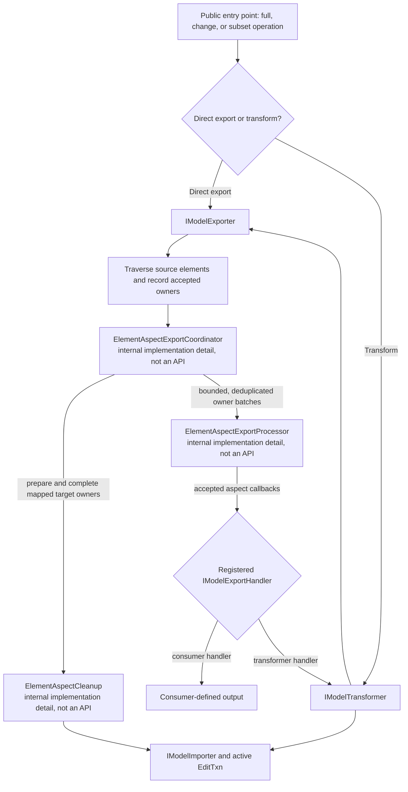
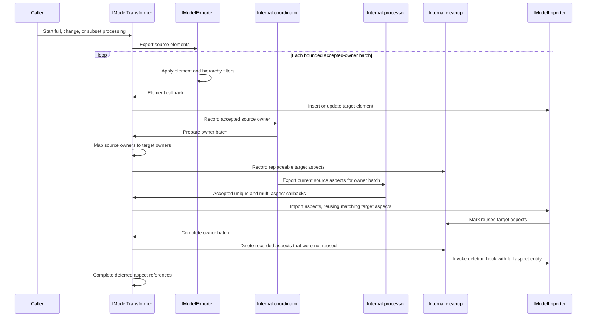

# Processing ElementAspects

`IModelExporter` processes ElementAspects separately from their owning element callbacks. It collects accepted element owners and exports their aspects in bounded, owner-scoped query batches. Applications must not assume that an aspect callback immediately follows the callback for its owner.

## When processing runs

Owner-batched ElementAspect processing runs whenever `IModelExporter` processes elements: a full export, a change export, or a subset export. Transformer subset methods such as `processElement` and `processSubject` use the same workflow.

`IModelExporter` can run by itself with a registered handler. When `IModelTransformer` drives the exporter, the transformer maps accepted source owners to target owners and `IModelImporter` applies target changes through its active `EditTxn`.

An **owner** is the source `Element` referenced by an ElementAspect's `Element` property. An **accepted owner** is in the current operation's scope and has passed the same element, hierarchy, model, and `shouldExportElement` checks used during element traversal. Accepting an owner does not automatically accept all its aspects. Class exclusion and `shouldExportElementAspect` are applied afterward.


```mermaid
flowchart TD
    A["Public entry point: full, change, or subset operation"] --> B{"Direct export or transform?"}
    B -->|"Direct export"| E["IModelExporter"]
    B -->|"Transform"| T["IModelTransformer"]
    T --> E
    E --> C["Traverse source elements and record accepted owners"]
    C --> CO["ElementAspectExportCoordinator<br/>internal implementation detail, not an API"]
    CO -->|"prepare and complete mapped target owners"| CL["ElementAspectCleanup<br/>internal implementation detail, not an API"]
    CL --> I["IModelImporter and active EditTxn"]
    CO -->|"bounded, deduplicated owner batches"| P["ElementAspectExportProcessor<br/>internal implementation detail, not an API"]
    P -->|"accepted aspect callbacks"| H{"Registered IModelExportHandler"}
    H -->|"consumer handler"| U["Consumer-defined output"]
    H -->|"transformer handler"| T
    T --> I
```

The named coordinator, processor, and cleanup classes explain the implementation. They are internal details and are not customization APIs. Public customization remains on `IModelExporter`, `IModelExportHandler`, `IModelTransformer`, and `IModelImporter`.

## Transformer-backed processing

Full, change, and subset transforms use the same owner-scoped sequence:


```mermaid
sequenceDiagram
    participant C as Caller
    participant T as IModelTransformer
    participant E as IModelExporter
    participant CO as Internal coordinator
    participant P as Internal processor
    participant CL as Internal cleanup
    participant I as IModelImporter

    C->>T: Start full, change, or subset processing
    T->>E: Export source elements

    loop Each bounded accepted-owner batch
        E->>E: Apply element and hierarchy filters
        E->>T: Element callback
        T->>I: Insert or update target element
        E->>CO: Record accepted source owner
        CO->>T: Prepare owner batch
        T->>T: Map source owners to target owners
        T->>CL: Record replaceable target aspects
        CO->>P: Export current source aspects for owner batch
        P->>T: Accepted unique and multi-aspect callbacks
        T->>I: Import aspects, reusing matching target aspects
        I->>CL: Mark reused target aspects
        CO->>T: Complete owner batch
        T->>CL: Delete recorded aspects that were not reused
        CL->>I: Invoke deletion hook with full aspect entity
    end

    T->>T: Complete deferred aspect references
```

Reconciliation uses the same accepted owner set for recording target aspects and exporting source aspects. If an element changes, the exporter exports all accepted current aspects for that owner, including aspects without their own change record. The importer matches each source aspect to an existing target aspect of the same class on the same owner:

- A unique aspect matches the owner's target aspect of the same class.
- A multi-aspect that this source imported before matches the target aspect recorded for it. The remaining multi-aspects of one class are matched in order. Extra source aspects are inserted, and extra target aspects are deleted.
- A matched aspect is updated only when its properties differ, and it keeps its target ID.
- Aspects recorded for another source iModel are never matched or deleted. See [Aspects from several sources](#aspects-from-several-sources).

After the owner batch is exported, cleanup deletes the recorded target aspects that the importer did not reuse. That removes aspects deleted from the source, aspects of classes that became empty, and aspects rejected by `shouldExportElementAspect`. A rerun with no source changes therefore inserts, updates, and deletes no aspects, unless a target aspect has a value for a property only the target schema has (see [Schema changes](#schema-changes)). `onInsertElementAspect`, `onUpdateElementAspect`, and `onDeleteElementAspect` run only for those actual writes.

iModel unique-aspect writes treat a class and its base or derived classes as one slot for an element. When a unique aspect has no exact-class match, the importer first deletes the owner's unique aspects of a base or derived class, through the deletion hook, and then inserts the new aspect. That includes a related aspect whose class is excluded: exclusion keeps cleanup from deleting it, but an included aspect of a base or derived class still takes its slot.

### Schema changes

Matching uses the class of the aspect that the transformer sends to the importer. That is the source aspect's class, unless an `onTransformElementAspect` override changes it. If a source schema change moves aspects to another class, including a base or derived class, the moved aspects have no exact-class match on the next run. The importer inserts them with the new class, and the old ones are deleted through the deletion hook: by cleanup after the batch or, for a unique aspect that moves to a base or derived class, by the importer before the insert. Those aspects get new target IDs once. Later reruns reuse them.

A target schema upgrade that adds a property the source doesn't have causes no writes while that property is unset. If a target aspect has a value for such a property, each rerun updates that aspect. The change check sees the target-only value as a difference, but the update doesn't include the property, so the value and the aspect ID are kept.

## Aspects from several sources

Several source iModels can map to the same target element. For example, two sources may each have a SpatialCategory with the same Code, and both transform into one target. Each source's aspects on that element belong to that source. A transform must not delete or overwrite another source's aspects just because its own source doesn't have them.

The transformer therefore records, for each target aspect it imports, the source iModel and the source aspect it came from. During reconciliation:

- Aspects recorded for the current source iModel are matched through their records and updated, kept, or deleted as the source changes.
- Aspects recorded for another source iModel are left alone: the importer doesn't match them, and cleanup doesn't delete them.
- Records take precedence over the transformer provenance rule. Provenance cloned with `includeSourceProvenance` that the current source recorded is matched through its record, and deleted when the source deletes it. Unrecorded transformer provenance is never deleted, as described in [Cleanup and importer hooks](#cleanup-and-importer-hooks).
- Aspects without a record, such as those written before records existed or by an application, are matched by position as before. The first source that matches one records it.
- A unique aspect slot that another source holds stays with that source. The current source's unique aspect of that class isn't imported.

Records are keyed by source iModel, not target scope, so one source imported in parts under different target scope elements shares one set of records.

Records are file properties in namespace `IModelTransformer` named `ElementAspectSource`, one per target aspect. They aren't ElementAspects: `getAspects` doesn't return them, and they're never exported, even with `includeSourceProvenance`. At the end of `process()`, the transformer removes records of target aspects that no longer exist, including aspects removed with their element or deleted outside the transformer. Subset methods such as `processElement` write records but don't remove stale ones; the next `process()` does.

Nothing is recorded with `noProvenance` or in reverse synchronization; those transforms match every aspect by position. With `wasSourceIModelCopiedToTarget`, the first run removes the records copied from the source iModel. They describe the source's own upstream imports, and keeping them would make every copied aspect look like it belongs to another source.

Two limits apply:

- An existing target written before records existed has no records. If a source without the shared element's aspects runs first, it treats them as its own and deletes them. The original source's next run inserts them again.
- Recording takes no locks. If two briefcases record the same target aspect at the same time, the second push fails with a conflict. Pull and run the transform again.

## Customization points

The public customization points are on `IModelExportHandler` and `IModelExporter`:

```ts
[[include:ElementAspectProcessingExamples_handler.code]]
```

```ts
[[include:ElementAspectProcessingExamples_exportAll.code]]
```

The exporter applies owner acceptance first, then class exclusion, then `shouldExportElementAspect`, and finally the export callback.

## Change processing

For an accepted changed owner, the transformer reconciles the owner's replaceable target aspects with its current source aspects through the active `EditTxn`, as described above. Cleanup does not remove excluded classes or transformer provenance aspects.

Custom inserted and updated aspect changes infer the owner while the source aspect exists. Deleted or missing source aspects cannot provide their owner, so `addCustomAspectChange` requires the source owner ID and throws when it is omitted:

```ts
[[include:ElementAspectProcessingExamples_deletedChange.code]]
```

The owner argument is change metadata. It does not select an aspect-processing strategy or customize the owner-batched workflow.

## Query prefilters and early exits

Source reads use two prefilters before querying concrete aspect classes:

1. A populated-class query finds the concrete `ECClassId` values that have rows.
2. Excluded class names are expanded to their class IDs and subclass IDs, and those classes are skipped.

For each owner set, the populated-class query joins the owner IDs through `IdSet(:ownerElementIds)`. A class populated elsewhere in the iModel therefore does not cause an empty concrete query for every batch. Populated-class results are not cached across owner batches.

The processor returns before excluded-class resolution or concrete-class queries when the owner set is empty or the populated-class prefilter finds no rows. Concrete source queries also join the owner set through `IdSet`; they do not build an owner predicate one ID at a time.

A new outermost coordinator scope clears the cached aspect class metadata and expanded excluded class IDs. Nested scopes and batch flushes reuse those caches. The values remain available after the scope ends so internal work that completes the same operation can reuse them. The next outermost scope clears them. Configured excluded class names remain in effect.

## Cleanup and importer hooks

Before an owner batch is exported, target cleanup joins the target owner batch through `IdSet(:elementIds)` and records the IDs of its replaceable unique and multi-aspects. Excluded target classes and transformer provenance aspects are never recorded. Transformer provenance means `Scope` `ExternalSourceAspect`s, and `Element` and `Relationship` aspects scoped to a target scope element: any element that owns a `Scope` aspect, not just the current one. An element shared by several target scopes, such as one source imported in parts or two sources matched by Code, carries each scope's provenance, and a transformation into one scope must keep the others'. When `includeSourceProvenance` is set, other cloned source `ExternalSourceAspect`s are reconciled like any other aspect, even if their scope maps to the target scope element. Cloned provenance from another transformation, such as the source's own imports, looks exactly like another target scope's provenance. The importer reuses such an aspect only for a source aspect with the same kind, scope, and identifier, and cleanup never deletes it, so a cloned provenance aspect that the source later deletes stays in the target. A cloned aspect that has the same kind, scope, and owner as the current scope's provenance can't be told apart from it, so the importer doesn't match it and each run inserts another copy. Cleanup also loads every target aspect of the batch's owners with one `elements.queryAspects` call, so `importElementUniqueAspect` and `importElementMultiAspects` match against those loaded aspects instead of querying each owner and class. Once the importer writes an aspect of an owner, later reads for that owner go to the target iModel, and calls made outside an owner batch always do. If the batch's export fails, cleanup discards what it loaded and deletes nothing. The importer marks each recorded aspect it reuses or deletes itself. After the batch is exported, cleanup loads each remaining aspect with `elements.getAspect` and invokes the importer deletion hook with the full concrete `ElementAspect`. Overrides can inspect class-specific properties before calling the base deletion behavior. Deleting requires an active target `EditTxn`.

Only aspect matches made by `IModelImporter.importElementUniqueAspect` and `IModelImporter.importElementMultiAspects` count as reuse. A custom handler that writes a recorded target aspect some other way does not stop cleanup from deleting it. While a batch is imported, the importer reads its owners' aspects from what cleanup loaded. After the importer writes an owner's aspects, it reads that owner from the target iModel. If anything else writes to the target during the batch, such as a custom handler calling `EditTxn` directly, the importer detects it from SQLite's change count on the target connection and reads from the target iModel for the rest of the batch.

## Calling the importer directly

`IModelImporter.importElementUniqueAspect` and `IModelImporter.importElementMultiAspects` can be called without a transformer. They then compare only against the owner's existing target aspects. No cleanup runs afterward, so a target aspect that the call doesn't match is left as it is.

Matching is by exact class. `getAspects` also returns aspects of derived classes, but the importer ignores those unless the call includes props of that derived class:

- `importElementUniqueAspect` reuses the owner's unique aspect of exactly the given class. It updates that aspect only when its properties differ and returns its ID.
- If there's no exact-class match, `importElementUniqueAspect` deletes the owner's unique aspects of a base or derived class through `onDeleteElementAspect`, then inserts the aspect and returns the new ID. iModel unique-aspect writes treat those classes as one slot, so leaving them would let the insert or a later delete remove data without the hook running.
- `importElementMultiAspects` groups the props by `classFullName`. Within each class, it matches target aspects of exactly that class in `getAspects` order, updates only changed ones, inserts extra props, and deletes extra target aspects of that class. Aspects of other classes, including derived classes, aren't touched.

Both methods take an options object:

- `filter` returns false for existing target aspects that the call must not match, update, or delete. If such an aspect holds the unique slot, `importElementUniqueAspect` imports nothing and returns `Id64.invalid`.
- `targetAspectIds` (multi-aspects only) gives, for each entry, the existing target aspect it updates, for example from the caller's own record of earlier imports. Entries without one, or whose target aspect no longer exists, has another class, or is rejected by `filter`, are matched in order as above.

The importer never matches by an incoming `props.id`, because props copied from another iModel carry that iModel's IDs.

Pass each aspect with its concrete `classFullName`, as `getAspects` and `getAspect` return it. To remove aspects of a class that the call doesn't include, delete them with `EditTxn.deleteAspect`.

## Scope memory and large models

`processElement`, `processModel`, `processModelContents`, and `processSubject` scope ElementAspect processing to the elements accepted by that operation.

The coordinator limits each source and target query batch, currently to at most 1,000 accepted owners in built-in traversal. The batch bound limits IDs passed to each ECSQL query and avoids a separate query per owner.

Deduplication lasts for the outer scope, not just one query batch. The coordinator retains processed owner IDs so an owner encountered as `A, B, A` across separate batches is processed once. Nested scopes share this set. A later outer scope clears the set and can process the owner again. Query inputs remain bounded by batch size, while processed-owner memory grows with the number of distinct owners visited in the active outer scope.

The processor combines accepted concrete multi-aspect classes into one callback per owner. The transformer retains aspect remaps until deferred references are complete.

Applications should not depend on an ordering relationship between element callbacks and aspect callbacks. Use source and target IDs supplied to callbacks, and keep custom state keyed by those IDs when a workflow needs to correlate them.
