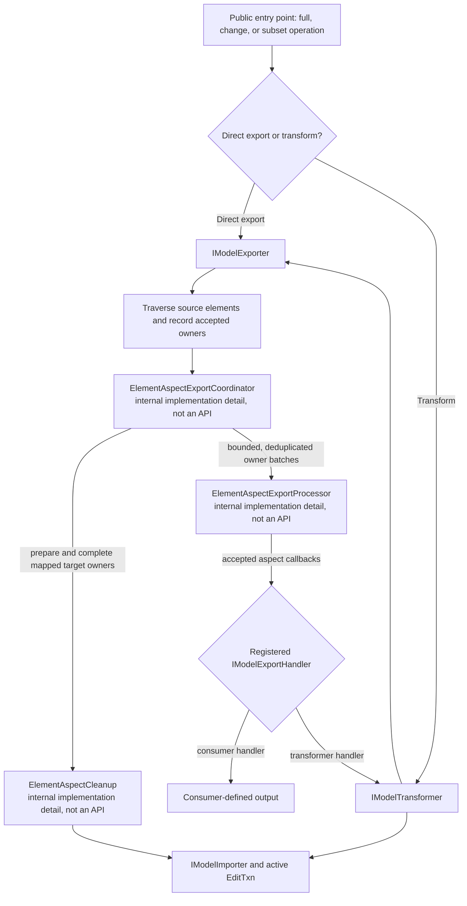
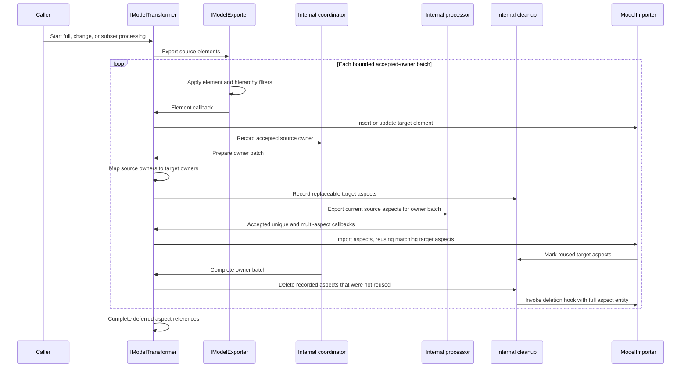

# Processing ElementAspects

`IModelExporter` processes ElementAspects separately from their owning element callbacks. It collects accepted element owners and exports their aspects in bounded, owner-scoped query batches. Applications must not assume that an aspect callback immediately follows the callback for its owner.

## When processing runs

Owner-batched ElementAspect processing runs whenever `IModelExporter` processes elements: a full export, a change export, or a subset export. Transformer subset methods such as `processElement` and `processSubject` use the same workflow.

`IModelExporter` can run by itself with a registered handler. When `IModelTransformer` drives the exporter, the transformer maps accepted source owners to target owners and `IModelImporter` applies target changes through its active `EditTxn`.

An **owner** is the source `Element` referenced by an ElementAspect's `Element` property. An **accepted owner** is in the current operation's scope and has passed the same element, hierarchy, model, and `shouldExportElement` checks used during element traversal. Accepting an owner does not automatically accept all its aspects. Class exclusion and `shouldExportElementAspect` are applied afterward.


```mermaid
flowchart TD
    A["Public entry point: full, change, or subset operation"] --> B{"Direct export or transform?"}
    B -->|"Direct export"| E["IModelExporter"]
    B -->|"Transform"| T["IModelTransformer"]
    T --> E
    E --> C["Traverse source elements and record accepted owners"]
    C --> CO["ElementAspectExportCoordinator<br/>internal implementation detail, not an API"]
    CO -->|"prepare and complete mapped target owners"| CL["ElementAspectCleanup<br/>internal implementation detail, not an API"]
    CL --> I["IModelImporter and active EditTxn"]
    CO -->|"bounded, deduplicated owner batches"| P["ElementAspectExportProcessor<br/>internal implementation detail, not an API"]
    P -->|"accepted aspect callbacks"| H{"Registered IModelExportHandler"}
    H -->|"consumer handler"| U["Consumer-defined output"]
    H -->|"transformer handler"| T
    T --> I
```

The named coordinator, processor, and cleanup classes explain the implementation. They are internal details and are not customization APIs. Public customization remains on `IModelExporter`, `IModelExportHandler`, `IModelTransformer`, and `IModelImporter`.

## Transformer-backed processing

Full, change, and subset transforms use the same owner-scoped sequence:


```mermaid
sequenceDiagram
    participant C as Caller
    participant T as IModelTransformer
    participant E as IModelExporter
    participant CO as Internal coordinator
    participant P as Internal processor
    participant CL as Internal cleanup
    participant I as IModelImporter

    C->>T: Start full, change, or subset processing
    T->>E: Export source elements

    loop Each bounded accepted-owner batch
        E->>E: Apply element and hierarchy filters
        E->>T: Element callback
        T->>I: Insert or update target element
        E->>CO: Record accepted source owner
        CO->>T: Prepare owner batch
        T->>T: Map source owners to target owners
        T->>CL: Record replaceable target aspects
        CO->>P: Export current source aspects for owner batch
        P->>T: Accepted unique and multi-aspect callbacks
        T->>I: Import aspects, reusing matching target aspects
        I->>CL: Mark reused target aspects
        CO->>T: Complete owner batch
        T->>CL: Delete recorded aspects that were not reused
        CL->>I: Invoke deletion hook with full aspect entity
    end

    T->>T: Complete deferred aspect references
```

Reconciliation uses the same accepted owner set for recording target aspects and exporting source aspects. If an element changes, the exporter exports all accepted current aspects for that owner, including aspects without their own change record. The importer matches each source aspect to an existing target aspect of the same class on the same owner:

- A unique aspect matches the owner's target aspect of the same class.
- Multi-aspects of one class are matched in order. Extra source aspects are inserted, and extra target aspects are deleted.
- A matched aspect is updated only when its properties differ, and it keeps its target ID.

After the owner batch is exported, cleanup deletes the recorded target aspects that the importer did not reuse. That removes aspects deleted from the source, aspects of classes that became empty, and aspects rejected by class exclusion or `shouldExportElementAspect`. A rerun with no source changes therefore inserts, updates, and deletes no aspects. `onInsertElementAspect`, `onUpdateElementAspect`, and `onDeleteElementAspect` run only for those actual writes.

iModel unique-aspect writes treat a class and its base or derived classes as one slot for an element. When a unique aspect has no exact-class match, the importer first deletes the owner's unique aspects of a base or derived class, through the deletion hook, and then inserts the new aspect.

## Customization points

The public customization points are on `IModelExportHandler` and `IModelExporter`:

```ts
[[include:ElementAspectProcessingExamples_handler.code]]
```

```ts
[[include:ElementAspectProcessingExamples_exportAll.code]]
```

The exporter applies owner acceptance first, then class exclusion, then `shouldExportElementAspect`, and finally the export callback.

## Change processing

For an accepted changed owner, the transformer reconciles the owner's replaceable target aspects with its current source aspects through the active `EditTxn`, as described above. Excluded classes and transformer provenance aspects are not removed.

Custom inserted and updated aspect changes infer the owner while the source aspect exists. Deleted or missing source aspects cannot provide their owner, so `addCustomAspectChange` requires the source owner ID and throws when it is omitted:

```ts
[[include:ElementAspectProcessingExamples_deletedChange.code]]
```

The owner argument is change metadata. It does not select an aspect-processing strategy or customize the owner-batched workflow.

## Query prefilters and early exits

Source reads use two prefilters before querying concrete aspect classes:

1. A populated-class query finds the concrete `ECClassId` values that have rows.
2. Excluded class names are expanded to their class IDs and subclass IDs, and those classes are skipped.

For each owner set, the populated-class query joins the owner IDs through `IdSet(:ownerElementIds)`. A class populated elsewhere in the iModel therefore does not cause an empty concrete query for every batch. Populated-class results are not cached across owner batches.

The processor returns before excluded-class resolution or concrete-class queries when the owner set is empty or the populated-class prefilter finds no rows. Concrete source queries also join the owner set through `IdSet`; they do not build an owner predicate one ID at a time.

A new outermost coordinator scope clears the cached aspect class metadata and expanded excluded class IDs. Nested scopes and batch flushes reuse those caches. The values remain available after the scope ends so internal work that completes the same operation can reuse them. The next outermost scope clears them. Configured excluded class names remain in effect.

## Cleanup and importer hooks

Before an owner batch is exported, target cleanup joins the target owner batch through `IdSet(:elementIds)` and records the IDs of its replaceable unique and multi-aspects. Excluded target classes and transformer provenance aspects are never recorded. The importer marks each recorded aspect it reuses or deletes itself. After the batch is exported, cleanup loads each remaining aspect with `elements.getAspect` and invokes the importer deletion hook with the full concrete `ElementAspect`. Overrides can inspect class-specific properties before calling the base deletion behavior. Deleting requires an active target `EditTxn`.

Only aspect matches made by `IModelImporter.importElementUniqueAspect` and `IModelImporter.importElementMultiAspects` count as reuse. A custom handler that writes a recorded target aspect some other way does not stop cleanup from deleting it.

## Scope memory and large models

`processElement`, `processModel`, `processModelContents`, and `processSubject` scope ElementAspect processing to the elements accepted by that operation.

The coordinator limits each source and target query batch, currently to at most 1,000 accepted owners in built-in traversal. The batch bound limits IDs passed to each ECSQL query and avoids a separate query per owner.

Deduplication lasts for the outer scope, not just one query batch. The coordinator retains processed owner IDs so an owner encountered as `A, B, A` across separate batches is processed once. Nested scopes share this set. A later outer scope clears the set and can process the owner again. Query inputs remain bounded by batch size, while processed-owner memory grows with the number of distinct owners visited in the active outer scope.

The processor combines accepted concrete multi-aspect classes into one callback per owner. The transformer retains aspect remaps until deferred references are complete.

Applications should not depend on an ordering relationship between element callbacks and aspect callbacks. Use source and target IDs supplied to callbacks, and keep custom state keyed by those IDs when a workflow needs to correlate them.
