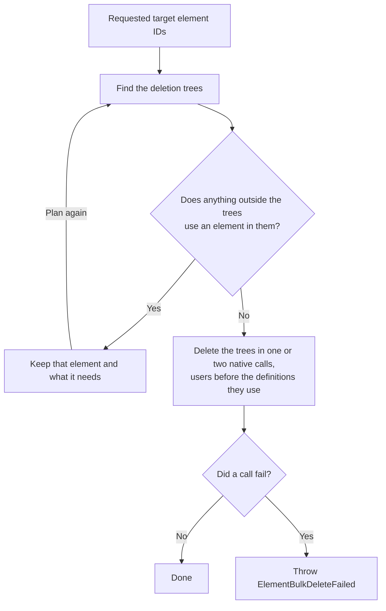

# Deleting elements

`IModelImporter.deleteElements()` deletes a set of target elements and everything that depends on them. It keeps any element that something outside the deletion still uses, logs a warning, and deletes the rest. If a native deletion call fails, it throws; see [Handling deletion errors](#handling-deletion-errors).

## Where deletions come from

During change processing, `IModelExporter.exportChanges()` handles deletions after inserts and updates. It deletes models first, then passes every deleted source element ID to `IModelExportHandler.onDeleteElements()` in one set, then deletes relationships.

`IModelTransformer.onDeleteElements()` maps the source IDs to target IDs and calls `IModelImporter.deleteElements()` once. It leaves out source elements with no target element and target elements that were remapped by code. `IModelImporter.deleteElement(elementId)` goes through the same path with a one-element set.

The importer doesn't delete requested elements it doesn't update: those in `IModelImporter.doNotUpdateElementIds`, and the iModel's root elements (the root subject, the dictionary model's element, and the reality data source link partition) while `IModelImportOptions.skipPropagateChangesToRootElements` is `true`, its default. Such an element is still deleted if it's in the tree of another requested element. When no requested element is left, or none still exists, the importer returns without deleting anything.

## What gets deleted

Each requested element is the root of a deletion tree. The tree contains:

- the element's child elements, recursively;
- every element in the element's sub-model, recursively;
- every top-level element whose code scope is in the tree, with its own tree.

A requested element that is already in another requested element's tree is deleted as part of that tree. The importer ignores requested IDs that no longer exist.

## How the importer deletes



Before deleting anything, the importer checks the BisCore references that iTwin.js core validates when it deletes an element:

- the category of a 2D or 3D geometric element;
- the code scope of any element;
- the view definition that a view attachment, section drawing, or section drawing location shows;
- the display style, category selector, and model selector of a view definition;
- a category's default sub-category, which core treats as used by the category.

Parent and model references need no check, because the trees contain every child and sub-model element.

Core refuses to delete a category or view definition that another element in the same native call still uses, even when that element is also being deleted. So when the trees contain both, the importer deletes the elements that use them in a first call and the rest in a second call. Code scopes and a view definition's display style and selectors can be deleted in the same call as the elements that use them.

Geometry can also use definitions: geometry parts, render materials, textures, line styles, and non-default sub-categories. Only core can read which geometry uses them. When the trees contain one of these, the importer deletes the trees' geometric elements first, but it doesn't check whether an element outside the trees still uses it. If one does, core refuses the deletion and the importer throws `ElementBulkDeleteFailed`.

References from domain schemas aren't checked in advance either. Core still validates them on every native call, and the importer never passes `skipFKConstraintValidations`, which lets core delete a category that is still in use.

## Elements that are still in use

When an element outside the deletion trees uses an element in them through one of the checked references, such as its category, its code scope, or a view definition's display style, the importer keeps the used element instead of deleting it. For example, a category stays when a target element that didn't come from the source still uses it. The importer also keeps:

- the kept element's children and sub-model contents, such as a category's sub-categories;
- the elements whose deletion would delete a kept element or leave its parent, model, or code scope missing, such as the definition model that contains a kept category.

Everything else requested is still deleted, including other requested contents of that definition model. A kept element can use an element that is being deleted, such as its own category, so the importer repeats the check until nothing outside the trees uses an element in them. It then logs one warning in the `imodel-transformer.IModelImporter` category, listing up to ten kept elements, each with one element that still uses it.

A kept element's children and sub-model contents stay even when only its code is used as a scope. For example, a partition kept as a code scope keeps its whole sub-model.

The importer doesn't try again later. A kept element keeps its provenance, such as the FederationGuid it shared with the deleted source element, and the source deletion was already processed, so later syncs don't delete it, even after nothing uses it. To remove it, delete it yourself once nothing uses it.

## Handling deletion errors

A native deletion call can still fail, for example because geometry outside the trees uses a geometry part in them, or because of a reference from a domain schema. The importer then throws an `ITwinError` with scope `IModelTransformerErrorScope` and key `IModelTransformerError.ElementBulkDeleteFailed`. Its `status`, `sqlDeleteStatus`, and `failedIds` describe the failed call. Deletions from that call and earlier ones are still pending in the transaction, so abandon the transaction before fixing the dependency and retrying:

```ts
[[include:ErrorHandling.handle-bulk-delete-errors]]
```

See [Error handling in imodel-transformer](./error-handling.md) for the general error contract.

## Customizing deletion

A custom `IModelImporter` can override `onDeleteElements(elementIds: ReadonlySet<Id64String>)`. The override receives the requested elements after the importer drops the ones it doesn't update, not the expanded trees. Finish any work that needs the elements to exist, then call and await `super.onDeleteElements()` exactly once. That call does the deletion and resolves when it's finished.

A custom `IModelTransformer` can override `onDeleteElements(sourceElementIds: ReadonlySet<Id64String>)` to see the deleted source IDs before they are mapped. Call and await `super.onDeleteElements()` to map them and pass them to the importer.
