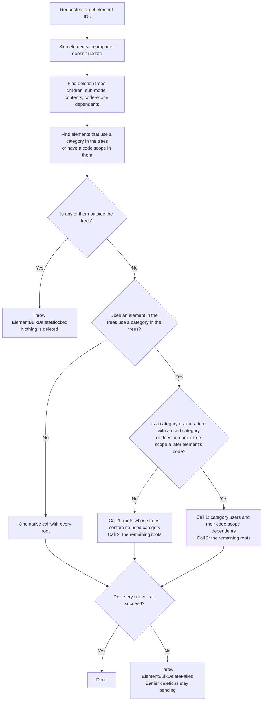

# Deleting elements

`IModelImporter.deleteElements()` deletes a set of target elements together with everything that depends on them. It either deletes every requested element or throws before deleting anything. When every requested element is skipped or no longer exists, it returns without deleting anything. The only exception is an unexpected native failure, described in [Handling deletion errors](#handling-deletion-errors).

## Where deletions come from

During change processing, `IModelExporter.exportChanges()` handles deletions after inserts and updates. It deletes models first, then passes every deleted source element ID to `IModelExportHandler.onDeleteElements()` in one set, and then deletes relationships.

`IModelTransformer.onDeleteElements()` maps the source IDs to target IDs and calls `IModelImporter.deleteElements()` once. It skips source elements with no target element and target elements that were remapped by code. `IModelImporter.deleteElement(elementId)` sends its ID through the same path as a one-element set.

The importer skips requested elements that it doesn't update: those in `IModelImporter.doNotUpdateElementIds`, and the iModel's root elements (the root subject, the dictionary model's element, and the reality data source link partition) unless `IModelImportOptions.skipPropagateChangesToRootElements` is `false`. That option defaults to `true`. A skipped element can still be deleted as part of another requested element's tree.

## What gets deleted

Each requested element is the root of a deletion tree. The tree contains:

- the element's child elements, recursively;
- when the element is modeled by a sub-model, every element in that model, recursively;
- every top-level element whose code scope is an element in the tree. That element becomes the root of its own tree, so its children, sub-model contents, and code-scope dependents are deleted too.

The importer ignores requested IDs that no longer exist.

## How the importer deletes



Before each native call, iTwin.js core checks every root against the iModel as it was before that call. It refuses a root whose tree contains a category that another element in the same call uses, even when that element is also being deleted. Deleting the users of a category in an earlier call avoids this. Code scopes need no ordering, because core accepts an element and its code-scope dependents in the same call.

Deleting whole trees in two calls doesn't work when an element that uses a category is itself in a tree that contains a used category, such as a `Subject` whose tree contains both a definition model with the category and a physical model with the user. It also doesn't work when a first-call tree is the code scope of an element in a second-call tree. In those cases, the first call deletes the category users as roots of their own, together with every element whose code they scope, including elements that have a parent, and the second call deletes the remaining roots.

The check before deletion covers the BisCore references that block deletion and aren't already inside the trees: the category of 2D and 3D geometric elements, and code scopes. Parent and model references need no check, because the trees contain every child and sub-model element. References from domain schemas aren't checked in advance. Core still validates them, and a refused root makes the importer throw `ElementBulkDeleteFailed`.

The importer keeps core's reference validation on for every native call and never passes `skipFKConstraintValidations`. With that option, core can delete a category that another element still uses.

## Handling deletion errors

Both errors use the scope `IModelTransformerErrorScope`.

| Key                                               | What changed in the target                                                   | What to do                                                                                                                                                                                                                                               |
| ------------------------------------------------- | ---------------------------------------------------------------------------- | -------------------------------------------------------------------------------------------------------------------------------------------------------------------------------------------------------------------------------------------------------- |
| `IModelTransformerError.ElementBulkDeleteBlocked` | Nothing. The importer threw before any native call.                          | `blockedReferences` maps each blocked element to one element outside the trees that still references it. The error message lists only the first ten. Delete or change that element, or leave the blocked element in place. The transaction can continue. |
| `IModelTransformerError.ElementBulkDeleteFailed`  | Deletions from this and earlier native calls are pending in the transaction. | Abandon the transaction before correcting the dependency and retrying. `status`, `sqlDeleteStatus`, and `failedIds` describe the failed call.                                                                                                            |

```ts
[[include:ErrorHandling.handle-bulk-delete-errors]]
```

See [Error handling in imodel-transformer](./error-handling.md) for the general error contract.

## Customizing deletion

A custom `IModelImporter` can override `onDeleteElements(elementIds: ReadonlySet<Id64String>)`. The override receives the requested roots after the importer skips the elements it doesn't update, not the expanded trees. Complete any work that needs the elements to exist, then call and await `super.onDeleteElements()` exactly once. That call plans the deletion, makes one or two native calls, and resolves after every tree is deleted.

A custom `IModelTransformer` can override `onDeleteElements(sourceElementIds: ReadonlySet<Id64String>)` to see the deleted source IDs before they are mapped. Call and await `super.onDeleteElements()` to map them and pass them to the importer.
