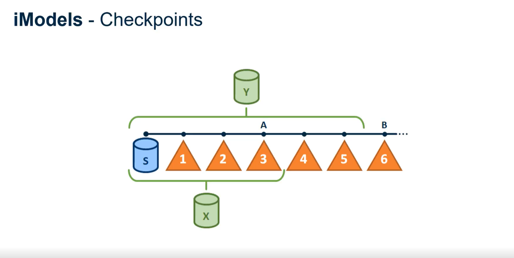

# Getting Started with iModel-Transformer

## Overview

The repository supports both JavaScript and TypeScript. To build a strong foundation, check out these resources:

- **JavaScript:**  
  [The Modern JavaScript Tutorial](https://javascript.info/)  
  [Mozilla JavaScript Reference](https://developer.mozilla.org/en-US/docs/Web/JavaScript/Reference)
  
- **TypeScript:**  
  [TypeScript Documentation](https://www.typescriptlang.org/docs/)

For more details on the transformer itself:

- **Transformer Repo:** [GitHub - imodel-transformer](https://github.com/iTwin/imodel-transformer)
- **Transformer Docs:** [iTwinJS Transformer Learning](https://www.itwinjs.org/learning/transformer)
- **Branching & Synchronization:** [Branching iModels Documentation](https://github.com/iTwin/imodel-transformer/blob/main/docs/learning/transformer/branching-imodels.md)

## iModel Files, Changesets & Checkpoints

Below is an image of an iModel Checkpoint showcasing some important concepts that are good to know:

- **Seed File (S):**  
  This is the base state of an iModel.

- **Changesets:**  
- A Changeset represents a group of changes to an iModel. Changesets are created whenever a local copy of the iModel is modified and reflect the union of all additions, deletions, and modifications over a period of time.
  Incremental updates to the iModel. For example:
  - To reach **Point A**, download the seed file (S) and apply changesets 1, 2, and 3 in order.
  - To reach **Point B**, download the seed file (S) and apply changesets 1 through 6 sequentially.

- **Checkpoints:**  
  A checkpoint is a full snapshot of the iModel at a given point, with changesets already applied. This can be used to reduce number of Changesets needed to apply to get to a certain version of the iModel.
  - **Checkpoint X** might represent the state after changesets 1–3, letting you quickly access **Point A**.
  - To reach **Point B**, you might download **Checkpoint Y** and apply only the remaining changes (e.g., changeset 6).

## Key Concepts

- **Snapshot:**  
  A [static](https://www.itwinjs.org/learning/backend/accessingimodels/#snapshot-imodels) point-in-time representation of an iModel’s state.

- **Briefcase:**  
  A file holding a copy of an iModel. It includes data from [changesets](https://www.itwinjs.org/learning/glossary/#changeset) as well as local changes. See [BriefcaseDb](https://www.itwinjs.org/learning/backend/imodeldb/).

- **Provenance:**  
  The tracking of where an entity originated within an iModel. They are useful for letting us know where the entity comes from. The IModelTransformer will also store provenance as it makes changes to a target; provenance will be used during [synchronizations](https://github.com/iTwin/imodel-transformer/blob/main/docs/learning/transformer/branching-imodels.md#synchronization-implementing-branching) to identify which elements in the branch correspond to those in the master, in order to find conflicts in changes.

- **Synchronization:**  
  The process of transferring change history between iModels, allowing for branching and merging.
  - **First Synchronization:**  
    Initializes a branch iModel from the master (think of it as creating a new Git branch).
  - **Forward Synchronization:**  
    Merges changes from the master to an existing branch (similar to `git merge master`).
- **Reverse Synchronization:**  
  Merges changes from a branch back into the master from which it was created(like merging a pull request in Git).
  - For more info: [Branching iModels Documentation](https://github.com/iTwin/imodel-transformer/blob/main/docs/learning/transformer/branching-imodels.md#synchronization-implementing-branching)

- **External Source Aspect:**  
  A specialized Element Aspect that records an element’s origin in an external repository. This aids in provenance tracking.

- **Target Scope Element:**  
  A designated element in the target iModel that represents the source repository as a whole.  

- **ProcessAll vs. ProcessChanges:**
  - **ProcessAll:**  
    Copies the all contents of the source iModel to the target.
  - **ProcessChanges:**  
    Only transfers incremental modifications (additions, updates, deletions) since the last synchronization. This method is useful for ongoing updates.

## Getting Hands-On

A practical way to learn the transformer is by writing a unit test that performs a transformation and using breakpoints to step into methods that do the transformation to see what is happening behind the scenes and asking questions about things that you are not clear about. This approach helps you understand element mapping, BIS concepts, synchronization, external source aspects, changesets, and provenance tracking.

## Additional Learning Materials

- **Base Infrastructure Schemas (BIS):**  
  [BIS Article](https://medium.com/itwinjs/hablas-bis-90e6f99c8ac2)  
  [BIS Documentation](https://www.itwinjs.org/bis/)
  
- **Changeset Details:**  
  [Learn about Changesets](https://developer.bentley.com/apis/imodels-v2/overview/#changesets)