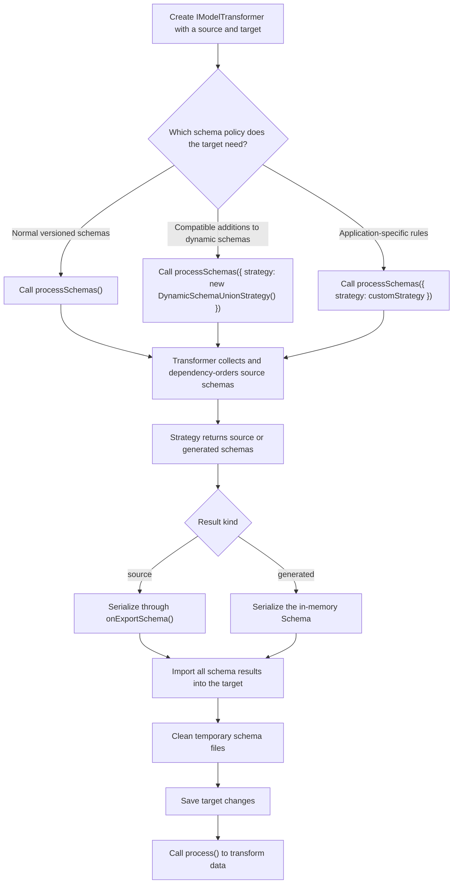

# Schema processing in a transformation

An iModel schema defines the classes, properties, relationships, and other metadata used by the data in that iModel. Before an `IModelTransformer` can copy instances from a source iModel to a target iModel, the target must have compatible definitions for those instances. `processSchemas()` prepares the target schemas before the transformer processes elements, models, relationships, and aspects.

## Choose a schema-processing strategy

`processSchemas()` accepts a `SchemaProcessingStrategy`. A strategy receives source schemas in dependency order and decides which definitions the transformer should import. It may inspect the target iModel but must not modify it. The transformer owns serialization, long schema-name handling, import, and temporary-file cleanup.

| Strategy | Use it when |
|---|---|
| `NewerVersionSchemaImportStrategy` | The source schemas follow normal versioning and the target should import schemas that are missing or older. |
| `DynamicSchemaUnionStrategy` | Source and target iModels may contain different compatible additions to the same dynamic schema. |

Call `processSchemas()` before `process()`. The transformer does not process schemas automatically because a target may need a different schema policy from its data transformation policy.



The caller supplies only the strategy instance. The transformer creates the `SchemaProcessingContext`, calls the strategy, and handles every later stage shown in the diagram. Saving after `processSchemas()` is recommended because processing data is more efficient after schema changes have been saved.

When no strategy is supplied, `NewerVersionSchemaImportStrategy` is used. Passing that strategy explicitly has the same behavior. It imports a schema when the schema is absent from the target or its source version is newer. It also uses the transformer's `shouldExportSchema()` and `onExportSchema()` overrides, so existing subclasses keep their schema selection and serialization behavior.

## Use dynamic schema unions when needed

A dynamic schema is an application-specific schema created while reading source data whose shape is not fully known in advance, such as data with user-defined classes or properties. These schemas use the `CoreCustomAttributes.DynamicSchema` custom attribute. Different source files or worksets can produce schemas with the same name and version but different valid additions.

`DynamicSchemaUnionStrategy` is opt-in. It compares matching dynamic schemas and generates a union that preserves compatible source-only and target-only definitions. Ordinary schemas use the transformer's `shouldExportSchema()` hook, whose default behavior selects missing or newer schemas. The strategy does not call that hook for dynamic schemas because skipping one side of a dynamic schema could discard definitions that the union must preserve.

```ts
const transformer = new IModelTransformer({
  source: sourceDb,
  target: editTxn,
});

await transformer.processSchemas({
  strategy: new DynamicSchemaUnionStrategy(),
});

await transformer.saveChanges("Processed schemas");
await transformer.process();
```

Applications using this strategy must provide versions of `@itwin/ecschema-editing` and `@itwin/ecschema-locaters` that satisfy the `@itwin/imodel-transformer` peer dependency ranges.

Only schemas with matching root read and write versions can be unioned. Minor-version differences are allowed because they represent read/write-compatible schema changes. A read or write mismatch requires an explicitly authored schema upgrade or a custom strategy with domain-specific compatibility rules.

A successful union uses the greater source or target minor version plus one. If the schema content is identical and only the minor version differs, the strategy leaves the target unchanged. It imports the newer source schema only when another generated schema requires that version as a dependency.

The strategy rejects structural conflicts, incompatible reference versions, changes to the dynamic-schema marker, and minor-version overflow. The transformer rejects dependency cycles before running the strategy because no valid source order exists. A reference-version difference is accepted only when its read and write versions match. The strategy never chooses the source or target definition for an unresolved conflict, and the transformer imports none of the strategy results when ordering or strategy processing fails.

## Customize conflict handling

Subclasses of `DynamicSchemaUnionStrategy` can override `onSchemaDifferences()` to adjust a `SchemaDifferenceResult` before conflict validation and merging. The hook receives the source schema, target schema, and complete differencing result. A subclass that changes the result is responsible for proving that its resolution is safe for both schemas. The default implementation returns the result unchanged.

Implement `SchemaProcessingStrategy` directly when an application needs a different policy, including an authored upgrade for an ordinary schema. A custom strategy returns source schemas or generated in-memory schemas; it does not serialize files or import schemas itself.

## Handle schema-processing errors

Schema failures use the exported `schemaProcessingErrorScope` and `SchemaProcessingErrorKey` identifiers. The keys distinguish schema conflicts, dependency cycles, and general processing failures where the transformer can classify them reliably. Original failures remain available through `cause`, and per-schema errors include the source schema key.

A single failure is a `SchemaProcessingError`. Two or more failures are returned in an `AggregateError` whose `errors` entries are machine-readable schema errors. Use `isSchemaProcessingError()` or `ITwinError.isError()` instead of matching messages. If ordering or strategy processing fails, no schema result from that invocation is imported. Fix the incompatible schemas or choose a custom strategy before retrying.
