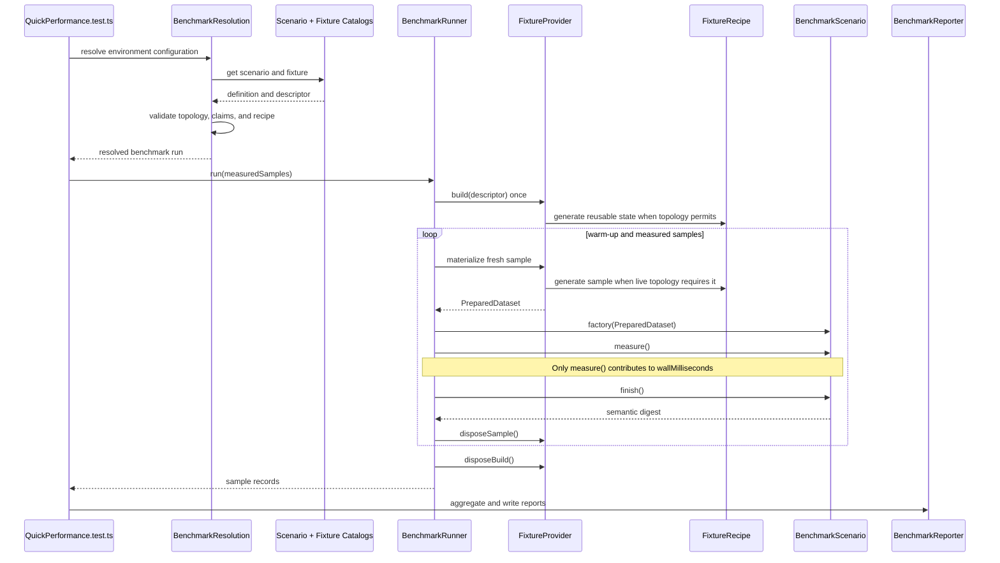

# Performance Test Architecture

This package has two independent performance systems:

- The **quick suite** runs deterministic, credential-free transformer benchmarks
  intended for fast local and manual CI feedback.
- The **weekly regression suite** runs long-lived comparisons against configured
  Hub iModels and generated local iModels.

Both use Vitest, but they have separate entry points, setup, data lifecycles,
timeouts, and reports. Infrastructure tests validate those systems without
measuring transformer performance.

## Quick suite component model

The quick suite has one performance entry point:
`test/quick/QuickPerformance.test.ts`. Configuration selects a scenario and
fixture; adding another scenario does not normally add another Vitest file.

### Terminology

#### Scenario

A scenario is the performance test. It defines the transformer behavior being
measured and the fixture capabilities it requires.

A `BenchmarkScenarioDefinition` contains:

- A stable scenario ID.
- A default fixture ID.
- The required fixture topology and claims.
- A factory that creates one scenario execution from a prepared dataset.
- An optional end-to-end job budget.

The created `BenchmarkScenario` separates:

- `measure()`: the transformer operation included in benchmark wall time.
- `finish()`: untimed correctness and provenance validation.
- `abort()`: cleanup when measurement or validation fails.

The current `incremental-synchronization` scenario measures
`IModelTransformer.process()` configured to process changes from a source
`BriefcaseDb` into an existing target `BriefcaseDb`.

#### Recipe

A recipe defines the deterministic iModel generated for a fixture. It describes
the data, not the benchmark operation or database lifecycle.

The current recipe controls:

- The EC schema imported into the source iModel.
- Initial elements, geometric elements, aspects, and relationships.
- The deterministic seed and scale.
- Element, aspect, relationship, and geometry edits.
- The number and ordering of pushed source changesets.
- Optional JSON-serializable data needed by a later detached scenario.

`createSeed()` builds the initial source seed. `applySourceChangesets()` applies
the recipe's deterministic edits to an open source briefcase. The provider owns
the `IModelHost`, `HubMock`, briefcase, and filesystem lifecycle.

#### Provider

A provider defines the physical iModel topology and how a pristine dataset is
delivered to each scenario sample. It owns database, Hub, changeset, and cleanup
resources. The scenario constructs `IModelTransformer` from those resources and
chooses its options and measured operation.

| Provider                    | Data delivered to the scenario                                                                     | Hub availability during the scenario | Stage-one behavior                                                                   |
| --------------------------- | -------------------------------------------------------------------------------------------------- | ------------------------------------ | ------------------------------------------------------------------------------------ |
| `liveHubProvider`           | Open source and target `BriefcaseDb`s backed by `HubMock`                                          | Available                            | Structural no-op; the complete Hub and briefcase dataset is rebuilt for every sample |
| `detachedBriefcaseProvider` | Read-only source `BriefcaseDb`, local changeset files, artifact metadata, and optional recipe data | Not available                        | Uses `HubMock` once to generate changesets, then captures a reusable local artifact  |

Both providers are credential-free and use local `HubMock` when they need
iModelHub semantics. “Detached” means detached during scenario consumption, not
that no Hub APIs were used to create the changesets.

There is currently no provider for a completely standalone
`SnapshotDb`-to-`SnapshotDb` transformation.

`liveHubProvider` currently performs the initial full transformation required by
incremental synchronization. A first-time schema or full-transform scenario
would need a provider topology that leaves the target pristine.

#### Configured fixture and generated descriptor

A configured fixture is a named, reproducible invocation combining:

- A recipe ID.
- A provider topology.
- Explicit typed recipe parameters.
- A deterministic seed.
- A fixture version.
- Claims describing which scenario behaviors the generated iModel supports.

Infrastructure derives the immutable `FixtureDescriptor` from that invocation.
The descriptor does not contain database objects or authoring callbacks; it is
the serializable artifact/report manifest used to choose and validate the
recipe/provider combination. Its distribution comes from the typed parameters,
while generator versions and the recipe hash are automatic.

#### Catalog

Benchmark registrations are the composition layer. Each registration bundles a
scenario with the configured fixtures it contributes. One explicit list in
`BenchmarkRegistry.ts` maps user-facing IDs to definitions and keeps compiled CLI
imports predictable.

Resolution follows this order:

1. Resolve `QUICK_PERF_SCENARIO`, or use the default scenario.
2. Resolve `QUICK_PERF_FIXTURE`, or use the scenario's default fixture.
3. Verify that fixture topology matches the scenario requirement.
4. Verify that the fixture advertises every required scenario claim.
5. Pass the registered configured fixture to the provider.

Catalogs select definitions. They do not create iModels or execute transformer
code.

### Object lifecycle

“Fixture” is used at three distinct lifecycle stages:

| Stage        | Type                | Meaning                                                           |
| ------------ | ------------------- | ----------------------------------------------------------------- |
| Authoring    | `ConfiguredFixture` | Named typed recipe invocation                                     |
| Manifest     | `FixtureDescriptor` | Derived immutable serializable generation identity                |
| Built state  | `BuiltFixture`      | Stage-one provider result; may reference a reusable artifact      |
| Sample state | `PreparedDataset`   | Fresh database objects and files handed to one scenario execution |

The provider translates the descriptor into built state and then materializes a
prepared dataset for every sample.

### Generic run flow



The runner wraps scenario, sample, fixture-build, and `IModelHost` lifecycles in
cleanup tasks. It attempts all applicable cleanup and preserves both originating
and cleanup errors when more than one operation fails.

## Current incremental-synchronization run

The default run resolves these components:

| Component | Selection                     |
| --------- | ----------------------------- |
| Scenario  | `incremental-synchronization` |
| Fixture   | `balanced-incremental`        |
| Recipe    | `balanced-incremental`        |
| Topology  | `source-and-empty-target`     |
| Provider  | `liveHubProvider`             |

For the warm-up and each measured sample:

1. `liveHubProvider` starts a fresh `HubMock`.
2. The recipe creates a source seed and imports
   `assets/schemas/QuickPerf.ecschema.xml`.
3. The provider creates source and target iModels and opens their
   `BriefcaseDb`s.
4. An initial full transformation establishes the target contents.
5. The provider pushes the target changes containing synchronization provenance.
6. The recipe applies eight deterministic source changesets.
7. Fixture validation checks the source content distribution.
8. The scenario creates an `IModelTransformer` for the source and target.
9. `measure()` times only `IModelTransformer.process()`.
10. `finish()` validates synchronization provenance and semantic equality.
11. The provider closes and deletes the sample briefcases and shuts down
    `HubMock`.

The calibrated source contains 6,000 base elements, 12,000 aspects, 3,000
relationships, and 3,000 geometric elements. Its eight changesets apply:

- 600 element inserts, updates, and deletes.
- 600 aspect inserts and updates, plus 1,200 aspect deletes.
- 300 relationship inserts and updates, plus 825 relationship deletes.
- 150 geometry updates.

These values are 25 deterministic repetitions of the recipe's balanced content
unit.

## Detached artifact lifecycle

`detachedBriefcaseProvider` supports the `source-only` topology. No benchmark
scenario in this layer consumes it yet; integration tests validate the lifecycle
for future source-only scenarios.

Stage one:

1. Start `HubMock` and create a source iModel.
2. Run the selected recipe and push its source changesets.
3. Download the changeset files.
4. Close the source briefcase and capture a portable artifact.
5. Shut down `HubMock`.

The artifact contains:

```text
fixture-artifact/
  briefcase.bim
  changesets/
  csFileProps.json
  manifest.json
  recipe.json        # only when the recipe returns artifact data
```

For each sample, the provider copies the artifact, rewrites changeset paths to
the sample directory, and opens `briefcase.bim` read-only. No Hub is running
while a scenario consumes that prepared dataset.

The artifact manifest records the fixture descriptor, briefcase identity and
size, changeset range, artifact format version, and build duration.
`recipe.json` transports deterministic expectations that cannot be recovered
from the final briefcase, such as IDs deleted by the recipe.

## Timing boundaries

The runner always executes sample zero as a warm-up. Warm-up setup, measurement,
validation, and teardown are identical to measured samples, but its wall time is
excluded from aggregate performance statistics.

| Measurement                  | Boundary                                               |
| ---------------------------- | ------------------------------------------------------ |
| `wallMilliseconds`           | Only `BenchmarkScenario.measure()`                     |
| CPU and RSS delta            | The same measured region                               |
| `fixtureBuildMilliseconds`   | Stage-one provider build, once per job                 |
| `reconstructionMilliseconds` | Creation or copying of one prepared sample             |
| `verificationMilliseconds`   | `BenchmarkScenario.finish()`                           |
| `teardownMilliseconds`       | Scenario and provider sample cleanup                   |
| `jobMilliseconds`            | Complete runner execution, used by the scenario budget |

For `incremental-synchronization`, only `IModelTransformer.process()` is inside
the measured region. Fixture generation, initial target transformation,
provenance setup, validation, and cleanup remain outside it.

## Reporting and reliability

Every run writes:

- `samples.jsonl`: one record per warm-up or measured sample.
- `summary.json`: structured aggregate used by workflow reporting.
- `summary.csv`: compact aggregate for external analysis.

Compare reports only when these identity fields match:

- `reportSchemaVersion`
- `scenarioId`
- `fixtureId`
- `fixtureVersion`
- `fixtureRecipeHash`
- Every `fixtureGenerator` version

The reporter rejects mixed scenario or fixture identities within one report.

| Field                    | Meaning                                                                  |
| ------------------------ | ------------------------------------------------------------------------ |
| `median`                 | Middle measured wall time                                                |
| `p90`, `p95`             | Linearly interpolated upper-percentile wall times                        |
| `mad`                    | Median absolute distance from the median                                 |
| `normalizedMad`          | MAD divided by the median                                                |
| `coefficientOfVariation` | Population standard deviation divided by the mean                        |
| `unstableSamples`        | Samples more than 15% away from the median                               |
| `varianceStatus`         | Reliability classification based on sample count, CV, and normalized MAD |

`stable` requires at least eight measured samples with both coefficient of
variation and normalized MAD at or below 5%. Fewer samples produce
`insufficient-samples`. An `unstable` run completed correctly but should not be
used as regression evidence.

Variance is currently advisory. Fixture correctness and the end-to-end scenario
budget are hard gates.

## Infrastructure tests

The harness tests validate the machinery without treating setup work as
performance evidence:

| Command                  | Coverage                                                                                                      |
| ------------------------ | ------------------------------------------------------------------------------------------------------------- |
| `test:quick-unit`        | Catalog lookup, environment resolution, descriptor identity, and statistics                                   |
| `test:quick-integration` | HubMock reconstruction, artifact construction/copying, database ownership, deterministic results, and cleanup |
| `test:quick-harness`     | Unit plus integration tests                                                                                   |
| `test:quick`             | The actual configured performance scenario                                                                    |

## Quick directory structure

```text
test/quick/
  QuickPerformance.test.ts
  assets/
    schemas/
  src/
    catalogs/
    cli/
    fixtures/
      providers/
      recipes/
      validation/
    framework/
    reporting/
    scenarios/
    support/
  tests/
    integration/
    support/
    unit/
  runtime/
```

The fixture CLI is compiled to native ESM under
`test/quick/runtime/.compiled/`. `runtime/package.json` creates an ESM-only
boundary for generated output without changing the package's TypeScript module
configuration.

## Weekly regression architecture

The weekly suite shares process-wide resources and therefore runs serially in
one Vitest worker with file parallelism disabled. Individual transformations and
downloads can run for hours, so the weekly entry point opts out of test and hook
timeouts.

### Collection

During Vitest collection, `TransformerRegression.test.ts`:

1. Loads environment configuration and authenticates.
2. Starts `IModelHost` with Hub access.
3. Discovers and filters configured Hub iModels.
4. Adds the generated local iModel.
5. Loads built-in and optional comparison transformer modules.
6. Builds supported test-case/module combinations.

If collection fails after authentication or host startup, cleanup attempts to
release every initialized resource before rethrowing the original failure.

### Execution

For each selected iModel, the suite:

1. Downloads or generates a local `.bim` source and records report metadata.
2. Opens a fresh read-only source database for each test.
3. Runs every supported test-case/module combination.
4. Closes the source database after each test.

The raw-insert comparison runs after the per-iModel transform cases. Once all
tests finish, the suite exports `test/.output/report.csv`, shuts down
`IModelHost`, and signs out.

### Registration

`RegressionTestRegistration.ts` creates the execution matrix; it does not run
tests or store results. Each test case names the factory required from
`TestTransformerModule`. Each loaded transformer module is paired only with the
cases it supports.

The module name is the human-readable identifier used in test names and reports.
Additional implementations can be loaded through `EXTRA_TRANSFORMERS`.

### Inputs and reporting

`template.env` documents weekly-suite configuration:

- `ITWIN_IDS`: iTwins from which test iModels are discovered.
- `IMODEL_IDS`: specific iModels to include, or `*` for every discovered iModel.
- `EXTRA_TRANSFORMERS`: optional comparison module paths.
- `LOG_LEVEL`: iTwin logger verbosity.

CI uses headless authentication. Local weekly runs use the CLI authorization
client and require the OIDC and Hub configuration from `template.env`. Never
commit a populated `.env` file.

`@itwin/perf-tools` combines case measurements with iModel and branch metadata,
then writes `test/.output/report.csv`. That path and CSV format are the artifact
contract consumed by the hosted weekly performance pipeline.
